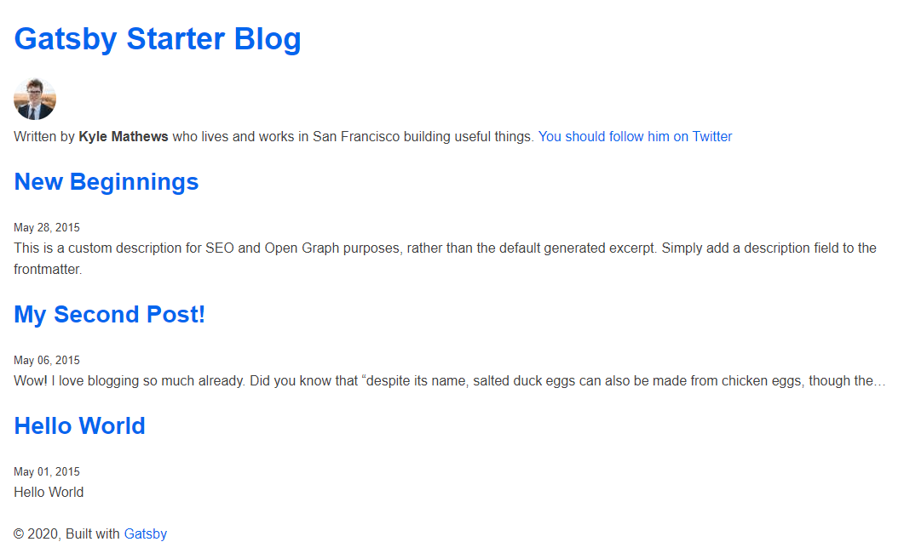
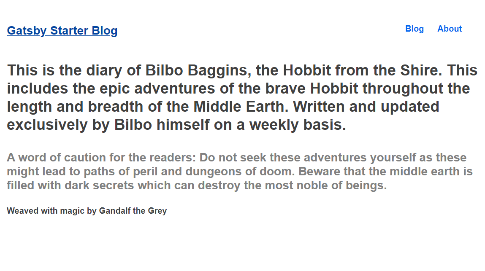
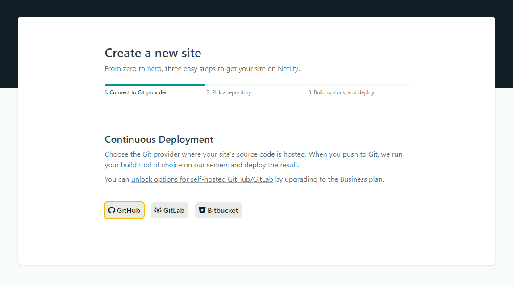
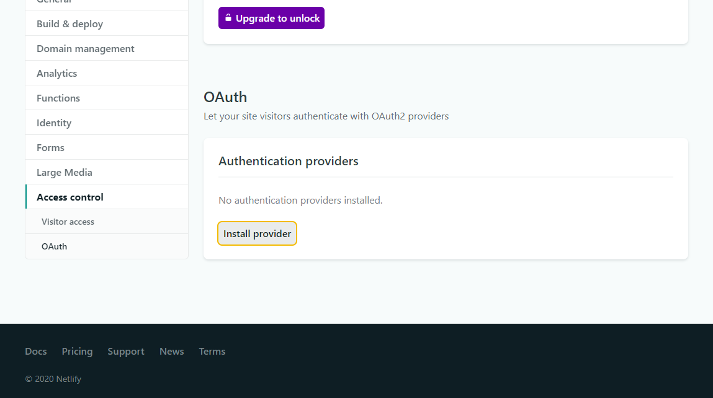
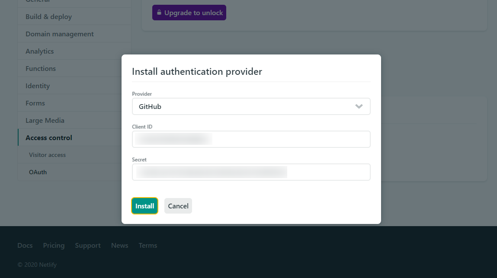

Gatsby is an awesome framework, I have created this website using [Gatsby](https://www.gatsbyjs.org/) as a site generator, [TailwindCSS](http://tailwindcss.com/) for styling, [Netlify CMS](https://www.netlifycms.org/) for my content related requirements and [Netlify](https://www.netlify.com/) for deployment. I wanted to sum up my experience and go through the process once again. Here is how I did it.

### Prerequisites

Having some familiarity with React and Gatsby will be useful. These two are excellent resources for [React](https://reactjs.org/tutorial/tutorial.html) and [Gatsby](https://www.gatsbyjs.org/tutorial/) to get a feel for things.

### The Setup

Install Gatsby-CLI globally.

```shell
$ npm install -g gatsby-cli
```

> For detailed instructions on how to set Gatsby up visit [here](https://www.gatsbyjs.org/tutorial/part-zero/)

Verify that Gatsby-CLI was correctly installed by running the help command.

```shell
$ gatsby --help
```

### Gatsby Starters

Starters are templates which provide a solid foundation for projects to build upon. Starters are official or community created templates which have the most basic packages and plugins already installed. I used the [gatsby-starter-blog](https://www.gatsbyjs.org/starters/gatsbyjs/gatsby-starter-blog/) for getting started with my project. To create a new project in Gatsby use the `gatsby new [website-name]` command. The template name goes after the `[website-name]`.

```shell
$ gatsby new bilbos-diary https://github.com/gatsbyjs/gatsby-starter-blog
```

Spin up the development server.

```shell
$ cd bilbos-diary
$ gatsby develop
```

Hitting [localhost:8000](http://localhost:8000) should look like [this](https://gatsby-starter-blog-demo.netlify.app/).

### Uninstall Tailwind

This starter uses [Typography.js](https://kyleamathews.github.io/typography.js/). Since I wanted to use another CSS alternative for typography and style, I uninstalled it.

```shell
npm uninstall gatsby-plugin-typography react-typography typography
```

I then went ahead and removed every rhythm and scale import and also deleted any inline style used within the starter. I also removed npm packages for typeface-montserrat, typeface-merriweather and then removed their imports from `gatsby-browser.js`

### Primitive CSS

For simplicity I will be using the [Primitive UI](https://taniarascia.github.io/primitive/index.html) here. TailwindCSS can also be setup quite easily by following [this](https://www.gatsbyjs.org/docs/tailwind-css/) and referring to [this starter](https://www.gatsbyjs.org/starters/taylorbryant/gatsby-starter-tailwind/).

Create a global styles file and copy [this](https://taniarascia.github.io/primitive/css/main.css) content within it.

```shell
$ cd src
$ mkdir styles
$ cd styles
$ touch global.css
```

Import the stylesheet in `gatsby-browser.js`

```javascript
import "./src/styles/global.css";
```

Before I spin up my development server, I want to go ahead and wrap our content in a [container](https://taniarascia.github.io/primitive/index.html#containers) provided by Primitive UI. In this starter the layout component handles the overall layout for the website. Therefore I used the container class within this component.

```jsx
<div className='container'>
  <header>{header}</header>
  <main>{children}</main>
  <footer>
    © {new Date().getFullYear()}, Built with
    {` `}
    <a href='https://www.gatsbyjs.org'>Gatsby</a>
  </footer>
</div>
```

At this point localhost:8000 should look like this.



### Refactoring Components

It would be better if the home page had a description instead of blog posts, further a header with a blog and an about section would look more appropriate. Having separate header and footer components will provide a better separation of concern and easier code maintenance in the long run. I want to start with the header first.

The header component can look like this.

```jsx
import React from "react";
import { Link } from "gatsby";

const Header = ({ title }) => {
  return (
    <div className='flex-row margin-top margin-bottom'>
      <div className='flex-small three-fourths'>
        <h3>
          <Link to={`/`}>{title}</Link>
        </h3>
      </div>
      <div className='flex-small'>
        <div className='flex-row'>
          <div className='flex-small text-right'>
            <h5>
              <Link to={`/blog`}>Blog</Link>
            </h5>
          </div>
          <div className='flex-small'>
            <h5>
              <Link to={`/about`}>About</Link>
            </h5>
          </div>
        </div>
      </div>
    </div>
  );
};

export default Header;
```

Any CSS classes used henceforth will be from Primitive UI. These can be found over [here](https://taniarascia.github.io/primitive/index.html#getting-started).

Since I don't want a different header style based on location or the route. I can refactor the layout component like this:

```jsx
import React from "react";
import Header from "./header";

const Layout = ({ title, children }) => {
  return (
    <div className='container'>
      <Header title={title} />
      <main>{children}</main>
      <footer>
        © {new Date().getFullYear()}, Built with
        {` `}
        <a href='https://www.gatsbyjs.org'>Gatsby</a>
      </footer>
    </div>
  );
};

export default Layout;
```

So far so good, the website looks quite decent to be honest. Moving on to the blog and the about component. The blog component will have the same code as the current index.js file. I created a blog.js file within the pages folder and then copied the content of index.js into it with some minor changes. To be specific the name of the component goes from BlogIndex to Blog and the location prop being passed into the layout component can be removed, the layout component no longer uses it as explained earlier.

```jsx
import React from "react";
import { Link, graphql } from "gatsby";

import Layout from "../components/layout";
import SEO from "../components/seo";

const Blog = ({ data }) => {
  const posts = data.allMarkdownRemark.edges;

  return (
    <Layout>
      <SEO title='Blog' />
      {posts.map(({ node }) => {
        const title = node.frontmatter.title || node.fields.slug;
        return (
          <article key={node.fields.slug} className='margin-bottom'>
            <header style={{ marginBottom: "0.75rem" }}>
              <h4 className='no-margin-bottom'>
                <Link to={node.fields.slug}>{title}</Link>
              </h4>
              <small>{node.frontmatter.date}</small>
            </header>
            <section>
              <p
                style={{ fontSize: "1.15rem" }}
                dangerouslySetInnerHTML={{
                  __html: node.frontmatter.description || node.excerpt,
                }}
              />
            </section>
          </article>
        );
      })}
    </Layout>
  );
};

export default Blog;

export const pageQuery = graphql`
  query {
    allMarkdownRemark(sort: { fields: [frontmatter___date], order: DESC }) {
      edges {
        node {
          excerpt
          fields {
            slug
          }
          frontmatter {
            date(formatString: "MMMM DD, YYYY")
            title
            description
          }
        }
      }
    }
  }
`;
```

Similarly, creating the about component in the pages directory.

```jsx
import React from "react";

import Layout from "../components/layout";
import SEO from "../components/seo";

const About = () => {
  return (
    <Layout>
      <SEO title='About' />
      <h2>About Bilbo</h2>
      <h3 style={{ color: "#808080" }}>
        Bilbo Baggins was a hobbit of the Shire, the main protagonist of The
        Hobbit and a secondary character in The Lord of the Rings. Gandalf
        suggested to Thorin and Company that they hire Bilbo Baggins to be their
        burglar in the Quest of Erebor, and later fought in the Battle of Five
        Armies. Bilbo was also one of the bearers of the One Ring, and the first
        to voluntarily give it up, although with some difficulty. He wrote many
        of his adventures in a book he called There and Back Again. Bilbo
        adopted his second-cousin-once-removed Frodo Baggins to be his heir
        after his parents, Drogo Baggins and Primula Brandybuck, drowned in the
        Brandywine River. Bilbo was the first hobbit to become famous in the
        world at large and was one of the few to set foot in the Undying Lands
        across the ocean.
      </h3>
      <h2>About Hobbits</h2>
      <h3 style={{ color: "#808080" }}>
        Hobbits, also known as Halflings, were an ancient mortal race that lived
        in Middle-earth. Although their exact origins are unknown, they were
        initially found in the northern regions of Middle-earth and below the
        Vales of Anduin. At the beginning of the Third Age, hobbits moved north
        and west. Most of their race eventually founded the land of the Shire in
        about the year TA 1601, though one type of hobbit known as Stoors
        remained in the Anduin Vale (the type of hobbit Sméagol was).
      </h3>
    </Layout>
  );
};

export default About;
```

The GraphQL query in index can be copied to the blog component as well. However, by this point it is also clear that the layout component needs only one information from outside, the title. It would be better if layout can itself source this information, this would avoid code duplication and a single query situated in the layout component will be able to handle this. For components which are not pages in Gatsby this can be done through the use of [useStaticQuery](https://www.gatsbyjs.org/docs/use-static-query/) hook.

Using useStaticQuery hook the layout component can be refactored as this.

```jsx
import React from "react";
import { useStaticQuery, graphql } from "gatsby";
import Header from "./header";

const Layout = ({ children }) => {
  const data = useStaticQuery(
    graphql`
      query {
        site {
          siteMetadata {
            title
          }
        }
      }
    `
  );
  const title = data.site.siteMetadata.title;
  return (
    <div className='container'>
      <Header title={title} />
      <main className='margin-bottom'>{children}</main>
      <footer>
        <h5>Weaved with magic by Gandalf the Grey</h5>
      </footer>
    </div>
  );
};

export default Layout;
```

With this change the props being passed to the layout component can be removed, the query responsible for fetching the siteTitle can also be removed from both index and blog components.

```javascript
site {
  siteMetadata {
    title
  }
}
```

Infact, since the index component will only describe what the website is about I do not need to query for any information at all. I am going to go ahead and add some description to the index component and remove some redundant code. Also at this point I do not want to use the bio component, so I have removed it and any of it's references and imports.

```jsx
import React from "react";

import Layout from "../components/layout";
import SEO from "../components/seo";

const Home = () => {
  return (
    <Layout>
      <SEO title='Home' />
      <h1>
        This is the diary of Bilbo Baggins, the Hobbit from the Shire. This
        includes the epic adventures of the brave Hobbit throughout the length
        and breadth of the Middle Earth. Written and updated exclusively by
        Bilbo himself on a weekly basis.
      </h1>
      <h3 style={{ color: "#808080" }}>
        A word of caution for the readers: Do not seek these adventures yourself
        as these might lead to paths of peril and dungeons of doom. Beware that
        the middle earth is filled with dark secrets which can destroy the most
        noble of beings.
      </h3>
    </Layout>
  );
};

export default Home;
```

The overall structure and styling of the website is now complete, at this point the website should look somewhat like this.



### Adding Netlify CMS

Moving on I will now add [Netlify CMS](https://www.netlifycms.org/) so that I can manage by blog posts through a CMS. First comes the dependencies.

```shell
$ npm install --save netlify-cms-app gatsby-plugin-netlify-cms
```

Once the dependencies are installed, the configuration follows. The configuration requires the presence of a `config.yml` file within `static\admin` directory.

```shell
├── static
│   ├── admin
│   │   ├── config.yml
```

```shell
$ cd static
$ mkdir admin
$ touch config.yml
```

The config can have the following content.

```yml
backend:
  name: git-gateway
  repo: master

media_folder: content/assets
public_folder: ../assets

collections:
  - name: "blog"
    label: "Blog"
    folder: "content/blog"
    create: true
    media_folder: ""
    public_folder: ""
    path: "{{foldername}}/index"
    fields:
      - { label: "Folder Name", name: "foldername", widget: "string" }
      - { label: "Publish Date", name: "date", widget: "datetime" }
      - { label: "Title", name: "title", widget: "string" }
      - { label: "Body", name: "body", widget: "markdown" }
```

The config file basically specifies the structure of a Netlify CMS collection, for this particular config a blog collection is being set up. This has information like the folder structure, where the path is and what are the fields which are required while creating an entry of one such collection. Note the backend key attribute, this specifies the name of the source-gateway in this case it will be Github and the branch which will be a repository where this code will live.

```shell
content/
├── blog
│   ├── first-post-title
│   │   ├── index.md
│   │   └── post-image.jpg
└── └── second-post-title
        ├── index.md
        └── post-image.jpg
```

Adding the Netlify CMS plugin to the `gatsby-config.js` file.

```javascript
plugins: [...`gatsby-plugin-netlify-cms`];
```

### Pushing to Github and Deploying

Alright, it's time to push these changes to Github and deploy the website. I created a [repo](https://github.com/asheerrizvi/bilbos-diary.git) for this on Github and pushed my changes to this remote repository. Since I will be deploying my website on Netlify therefore I wanted to use Github as my source.

```shell
$ git add .
$ git commit -m "Pushing the website to remote."
$ git remote add origin https://github.com/asheerrizvi/bilbos-diary
$ git push origin master
```

Signing up on [app.netlify.com](https://app.netlify.com) I can click on the "New Site from Git" button and choose Github as a source followed by deploying the website with the default options.



Finally, to let Netlify CMS have access to my website, I need to setup an OAuth application on Github. This can be setup by following [these instructions](https://docs.netlify.com/visitor-access/oauth-provider-tokens/#using-an-authentication-provider). Once setup, I can go to the settings of my website on Netlify and open the "Access Control" section towards the bottom of these settings.



Clicking on "Install Provider" within the OAuth section I can copy and paste the Client ID and Secret from the OAuth application created on Github earlier and click the "Install" button.



### Accessing Netlify CMS

The website's name can be changed from the "General" tab in the website settings on Netlify. The website should now be accessible on the specified URL. As a final step I will revisit my `config.yml` file created earlier for specifying my Netlify CMS config. In the config file I will specify my Git source along with the name of the repository relative to my user account.

```yml
backend:
  name: github
  branch: asheerrizvi/bilbos-diary
```

Saving these changes I will push my website once again to my remote repository on Github. My website will now rebuild and Netlify will automatically redeploy the updated version of the website. To access the Content Manager I can now append `/admin/` to my website URL and login using Github.

I am going to remove some already existing blog posts and edit the one with the "Hello World" title. The changes will push new commits to our Github repository and the updated version of the website will be deployed by Netlify.

### Resources

The public repo for this website and the deployed website itself can be found on the links below:

* [Source Code](https://github.com/asheerrizvi/bilbosdiary)
* [Deployed Website](https://bilbosdiary.netlify.app)