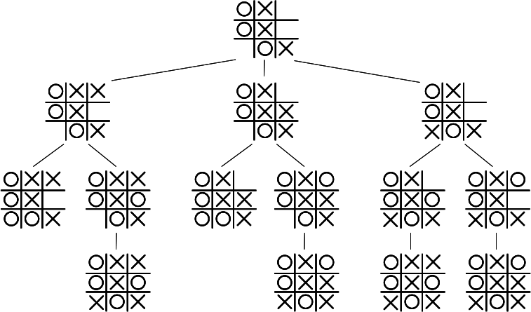
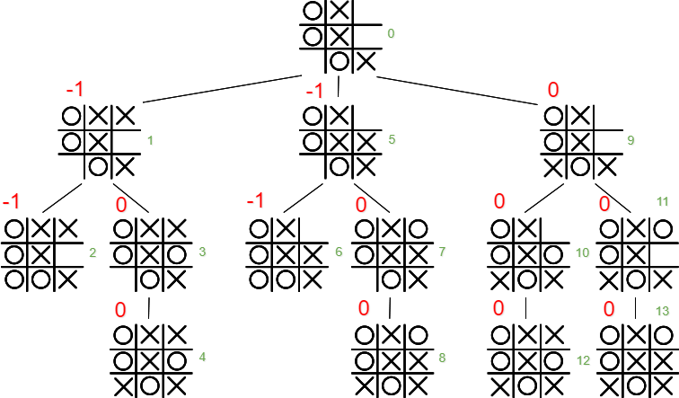

In a previous post, I went ahead and added Monte Carlo Simulation to React's official tutorial. Overall the goal wasn't too ambitious and it was a fairly straightforward port from Python to JavaScript. As mentioned [earlier](https://asheerrizvi.com/monte-carlo-simulation/) Monte Carlo has some flaws, it relies on the number of trials the simulation is run for and this while accurate in most cases might fall flat if the number of possible moves or the possibilities are higher than the number of trials being performed.

The [second part](https://www.coursera.org/learn/principles-of-computing-2/home/welcome) of the course introduced us to another strategy called the Minimax, which addresses some of the issues hampering Monte Carlo Simulation but comes with its own set of quirks.

### Mini-what?

Unlike Monte Carlo Simulation which tends to run random trials over the number of possible outcomes, Minimax relies on trees. The basic idea behind Minimax aims to minimze the maximum loss and hence the name. In Tic-Tac-Toe this leads to a player making a move which minimizes the damage which their opponent may cause in the very next move. To further drill onto that point, suppose a player has two possible moves to choose from within a Tic-Tac-Toe board. One move leads to a game draw and the other leads to a loss for the current player, the ideal Minimax move in such a situation would be to draw the game and hence we say that the player is minimizing their maximum loss.

In essence we assume that each player will inherently choose the best possible move for themselves. But where are the trees? Well for each move the current board representation acts as the tree node. The root node has all the possible moves from that point onwards as its children. Each subsequent level from that point onwards is rated or scored depending on the player who's having their turn at that level. Finally the branch having the best move possible is chosen for the next move.

### Scoring Boards

That escalated too quickly, time for an image.



The root node within this image represents the current board, the player to make the next move is \`X\` and it has three possible moves to choose from. Each level is scores based on the game's overall outcome, but the games can only be scores once they are completed and therefore score at a particular level can only be gauged from the representation of the board beneath it. I think it's time for another image, here is the above image but with scored game boards.



There are three possible outcomes for a game, a win for either \`X\` or \`O\` and a draw. I will give each win of \`X\` a score of 1, each win of \`O\` a score of -1 and each draw a score of 0. Consider the leaf nodes 2, 4, 6, 8, 12 and 13 in green numerals. These are the boards which have an outcome and must be scored first. As described earlier, I will rate them -1, 0, -1, 0, 0 and 0 respectively. This will lead me to score boards 3, 7, 10 and 11 as well since each one of them has a single child and they will always result in a fixed outcome.

Now comes the interesting part, how should we score nodes 1, 5 and 9. Well each one of them represents the board position after a move by \`X\` from node 0. Therefore at this level the player to make the move is \`O\`. Well we know that \`O\` is not stupid and at each turn will try to make the best possible move. Therefore at node 1 it will make the move towards node 2 since this is where it will win, similarly for node 5 it will lean towards node 6 and hence the score for node 1 and 5 will be -1. At node 9 however there aren't any moves which will lead to a win therefore \`O\` will settle for a draw with a score of 0 and it doesn't matter which route the game takes from node 9 as any move from that point onwards will result in a draw.

A lot of text but at last we come to node 0, the root node. At node 0 the player to make the next turn is \`X\` and it has three possible moves to choose from. By traversing the tree in a depth first manner the player can see how the subsequent levels are scored. Therefore \`X\` knows that making moves through node 1 and 5 will result in a loss, node 9 on the other hand will result in a draw and \`X\` is also not stupid and makes it's move towards node 9.

### Overall Strategy

It's sounds overly complex but it isn't so bad when it comes to the amount of code which I had to write. Basically it requires you to write a single function and call it recursively for each node, it is described as below:

- **mmMove(board, player):** This function takes a current board and which player should move next. The function should use Minimax to return an array, the first element of which is a score for the current board and the second element is the best move for the player. In situations in which the game is over, you should return a valid score and the move -1. As -1 is an illegal move, it should only be returned in cases where there is no move that can be made.

### JavaScript Implementation

The class representing the board was same between Monte Carlo Simulation and Minimax, details about it's implementation can be read [here](https://asheerrizvi.com/monte-carlo-simulation/) and the class file can be viewed within the [repo](https://github.com/asheerrizvi/tic-tac-toe-minimax/blob/master/src/board.js).

```javascript
/*
  Minimax Tic-Tac-Toe Player
*/

import { switchPlayer } from './board';

// Setup a scoring object for scoring completed boards.
const SCORES = {
  X: 1,
  Draw: 0,
  O: -1,
};

/**
 * Takes the current board and the player to make the move and returns the move which minimizes the maximum loss.
 * @param {TTTBoard} board - Takes a representation of the TTTBoard Class.
 * @param {String} player - The player for which the best move should be calculated.
 */
function mmMove(board, player) {
  let checkWin = board.checkWin();

  // If the current board has completed return the associated score
  // along with -1 indicating that the board has completed.
  if (checkWin !== null) {
    return [SCORES[checkWin], -1];
  } else {
    // Setup an object to keep track of all possible results at each level of the tree.
    const movesFound = {
      [SCORES.X]: [],
      [SCORES.Draw]: [],
      [SCORES.O]: [],
    };

    // Call all the available moves at each level and recursively calculate the scores.
    for (let move of board.getEmptySquares()) {
      let clonedBoard = board.clone();
      clonedBoard.move(move, player);
      let [score] = mmMove(clonedBoard, switchPlayer(player));
      movesFound[score].push(move);
    }

    // Maximize the scores within the movesFound object.
    let scores = [];
    for (let score in movesFound) {
      if (movesFound[score].length > 0) {
        scores.push(score * SCORES[player]);
      }
    }

    // Return any element of the array having the maximum score.
    let score = Math.max(...scores) * SCORES[player];
    const scoresArray = movesFound[score];
    return [score, scoresArray[Math.floor(Math.random() * scoresArray.length)]];
  }
}

/**
 * Takes the current board and the player to make the move and in turn calls mmMove.
 * @param {TTTBoard} board - Takes a representation of the TTTBoard Class.
 * @param {String} player - The player for which the best move should be calculated.
 */
function moveWrapper(board, player) {
  const move = mmMove(board, player);
  return move[1] !== -1 ? move[1] : 'Returned invalid move -1';
}

export default moveWrapper;
```
Let us see what's going on. First of all the `moveWrapper`, this function's only purpose is to check the validity of the move and return and appropriate result. The original purpose of this function within the Python implementation was to allow interactivity similar to the Monte Carlo Simulation.

Coming back to `mmMove`, this function takes the current board representation and the player which needs to make the move. `mmMove` then traverses through the tree of all possible moves and returns the best possible move for the player. To achieve this it makes use of an object called `movesFound`, this object is used to keep track of all possible moves which result in a win for either of the two players or a draw.

The function then moves through every empty square currently within the board, and calls itself recursively to populate the `movesFound` object. When a complete brach is traversed it calculates the scores for that level by maximizing the scores within the `movesFound` object. And finally it returns the maximum possible score from the `scores` array. One thing to note is what is being pushed into the `scores` array. At this point I would like to quote a hint from the course page which helped me.

> In Minimax, you need to alternate between maximizing and minimizing. Given the `SCORES` that we have provided you with, player `X` is always the maximizing player and play `O` is always the minimizing player. You can use an `if-else` statement to decide when to maximize and when to minimize. But, you can also be more clever by noticing that if you multiply the score by `SCORES[player]` then you can always maximize. Why? Because this has the effect of negating player `O's` scores allowing you to maximize instead of minimize for player `O`.

The inherent logic for `index.js` remains the same between Monte Carlo Simulation and Minimax, the only change I did was to call the `moveWrapper` method like this `const bestMove = moveWrapper(tttBoard, machinePlayer);`. And there it is, as anti climatic as it may look this is all there is to Minimax in terms of Tic-Tac-Toe. However, Minimax has far reaching applications and is an extremely interesting strategy to understand and play with.

### The Limitations of Minimax

As Monte Carlo Simulation, Minimax also has some caveats. The biggest among'st them is performance. Since Minimax traverses through all possible moves and goes through every branch which stems from a particular board representation, it is natural that the algorithm will slow down if the size of the tree increases. One way to improve performance is to let go of branches which will result in non productive results. What this means is that instead of traversing the whole branch upto the last leaf node the algorithm can move onto the next branch once it's certain that the current branch would not prove useful.

### Resources

I have deployed the app on Github pages, since the app was created using create-react-app I used the official documentation for doing so.

The public repo for this app and the deployed app itself can be found on the links below:

- [Source Code](https://github.com/asheerrizvi/tic-tac-toe-minimax)
- [Deployed App](https://asheerrizvi.github.io/tic-tac-toe-minimax)