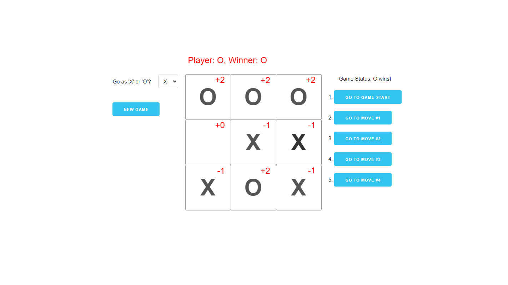
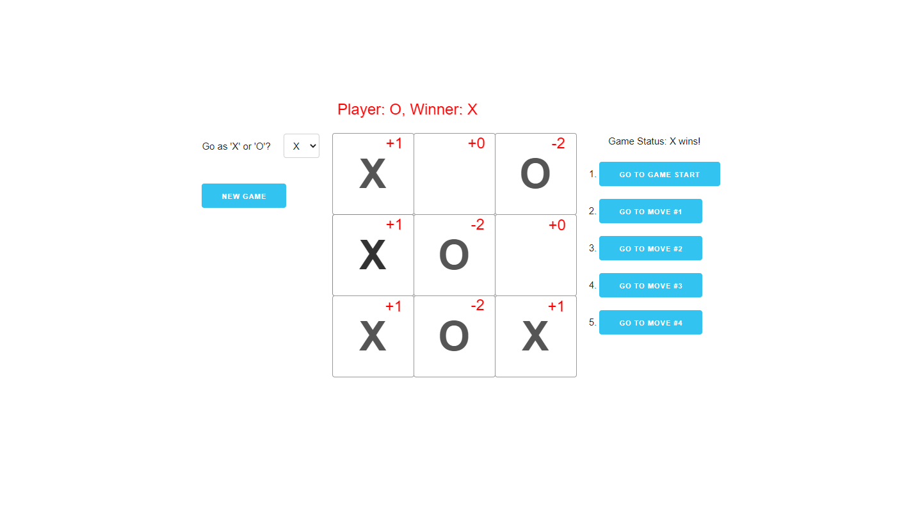
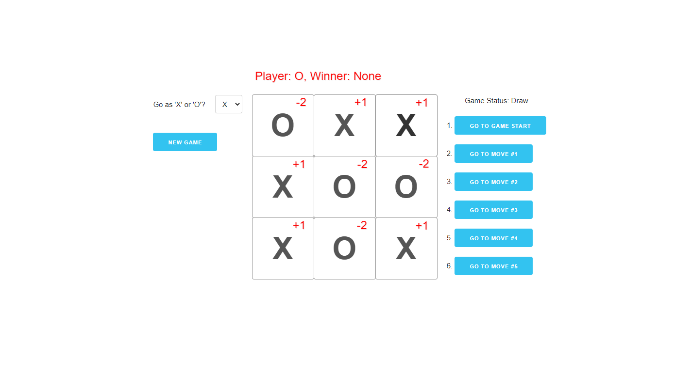
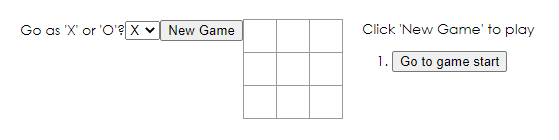
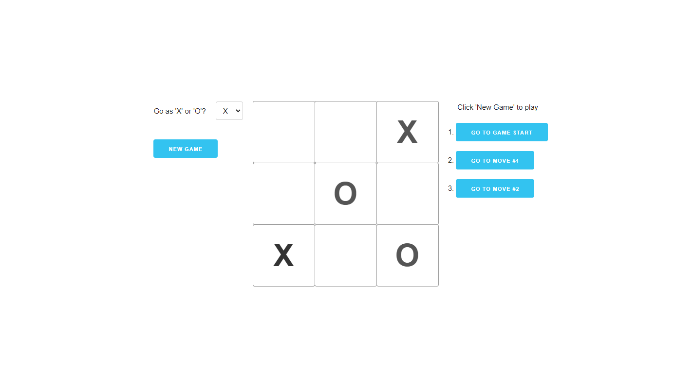

A couple of years ago I did a course offered by [Rice University](https://www.rice.edu/) called [Principles of Computing](https://www.coursera.org/learn/principles-of-computing-1/home/info). It was part of a bigger [specialization](https://www.coursera.org/specializations/computer-fundamentals) and was an amazing experience to go through as a naive computer programmer. Each week consisted of mandatory quizzes and mini project submissions, the mini projects were challenging and always left one with a feeling of satisfaction and pride. Week 3's mini project was the game of [Tic-Tac-Toe](https://en.wikipedia.org/wiki/tic-tac-toe), the goal was to build a computer program that can act as your opponent, it was supposed to be unbeatable or at least fairly difficult to beat (we actually built an unbeatable version of the game in the second part of the course).

Well, the thing is that React's [official tutorial](https://reactjs.org/tutorial/tutorial.html) also uses Tic-Tac-Toe to put forward the core principles of React. And I thought it would be great to bring back my python code from Principles of Computing, use it to enhance React's tutorial and create a full fledged Tic-Tac-Toe game.

### What is Monte Carlo Simulation?

The title says [Monte Carlo Simulation](https://en.wikipedia.org/wiki/Monte_Carlo_method) and I am blabbering about Tic-Tac-Toe. Well, Monte Carlo is the strategy which was used for coding this Tic-Tac-Toe game. When I think of Monte Carlo, I imagine two players of chess playing against each other. One of them is an exceptional genius who can visualize hundreds of moves and their outcomes in his mind. On each move made by the other player, our genius plays multiple such games within his head and then makes a move in which the probability of winning is the highest. This probability of winning is calculated by rating all of these hypothetical results in a cumulative total and then deriving some inference out of it. For Tic-Tac-Toe this simply means that before making each move the program plays _N_ games or trials on the current state of the game board, rate those games based on a win or a loss and then choose the move with the highest score.

For each move, the simulation performs these fundamental steps:

1. **Play a random game on a board starting with the given player:** Take a board representation and simulate a complete game while switching between the two players. This step concludes when the game ends in a win/loss or a draw.
2. **Update the rating based on the board and the player:** After the first step, the board is rated. This rating is determined by the player who won the game. Moves by the winning player are rated higher than the other player (more on scoring later).
3. **Repeat the above two steps _N_ times while adding the scores to a cumulative total:** The above two steps are repeated for the number of trials that needs to be run. Each of these boards are rated and the total is added to a scores grid.
4. **Get the best move and return it:** Finally the highest rated score from the scores grid is returned. This is the best move that the computer program can make.

### Overall Strategy

There were four functions which forms the crux of our Monte Carlo Simulation. These are described as follows:

- **mcMove(board, player, trials):** This function takes a current board and the next player to move. The function should play a game starting with the given player by making random moves, alternating between players. The function should return when the game is over. The modified board will contain the state of the game, so the function does not return anything. In other words, the function should modify the board input.

- **mcUpdateScores(scores, board, player):** This function takes a grid of scores (a list of lists) with the same dimensions as the Tic-Tac-Toe board, a board from a completed game, and which player the machine player is. The function should score the completed board and update the scores grid. As the function updates the scores grid directly, it does not return anything.

- **getBestMove(board, scores):** This function takes a current board and a grid of scores. The function should find all of the empty squares with the maximum score and randomly return one of them as a (row, column) tuple. It is an error to call this function with a board that has no empty squares (there is no possible next move), so your function may do whatever it wants in that case. The case where the board is full will not be tested.

- **mcTrial(board, player):** This function takes a current board, which player the machine player is, and the number of trials to run. The function should use the Monte Carlo simulation described above to return a move for the machine player in the form of a (row, column) tuple. Be sure to use the other functions you have written!

The course used a [two dimensional array](https://en.wikipedia.org/wiki/Array_data_structure#Multidimensional_arrays) to implement the Tic-Tac-Toe grid and the tutorial at React docs used a single dimensional array. Initially I tried converting back and forth between the two using some helper constants but quickly gave up, it was getting quite tedious and a bit messy. I eventually decided to go with a normal array instead of a grid. It resulted in a lot cleaner and concise code which was easier to read and maintain.

### Scoring Boards

When it comes to scoring a board there are 3 possible scenarios, the player wins the board, the player loses the board, and the board results in a draw.

In each of these cases, the scores for each square is either incremented or decremented by a certain constant. In this implementation, these constants are called `scoreCurrent` and `scoreOther` for the current player and the other player respectively. When a board results in a win for the current player, every square in which the current player made a move should be incremented by `scoreCurrent`. Squares in which the other player moved should be decremented by `scoreOther` and the empty squares are not incremented at all.



If the board results in a loss for the current player, every square in which the current player made a move should be decremented by `scoreCurrent`. Squares in which the other player moved should be incremented by `scoreOther` and the empty squares are not incremented at all.



Finally when the board results in a draw, every square in which the current player made a move should be decremented by `scoreCurrent`. Squares in which the other player moved should be incremented by `scoreOther`, this is done because the algorithm will then favour the squares of the other player in order to effectively block their moves.



### Writing the Board Class

A [class](http://www.codeskulptor.org/#poc_ttt_provided.py) representing the Tic-Tac-Toe board was provided. The class created a representation of the board and encapsulated some helper methods. These methods included functionality for making a move, getting the value at a particular square, checking for the final result of a game and cloning the board itself. The file also had two other functions for switching a player and a debugger for logging game values to the console. The class interface was something like this.

```py
class TTTBoard:
  """
  Class to represent a Tic-Tac-Toe board.
  """

  def __init__(self, dim, reverse = False, board = None):
    """
    Initialize the TTTBoard object with the given dimension and
    whether or not the game should be reversed.
    """

  def __str__(self):
    """
    Human readable representation of the board.
    """

  def get_dim(self):
    """
    Return the dimension of the board.
    """

  def square(self, row, col):
    """
    Returns one of the three constants EMPTY, PLAYERX, or PLAYERO
    that correspond to the contents of the board at position (row, col).
    """

  def get_empty_squares(self):
    """
    Return a list of (row, col) tuples for all empty squares
    """

  def move(self, row, col, player):
    """
    Place player on the board at position (row, col).
    player should be either the constant PLAYERX or PLAYERO.
    Does nothing if board square is not empty.
    """

  def check_win(self):
    """
    Returns a constant associated with the state of the game
      If PLAYERX wins, returns PLAYERX.
      If PLAYERO wins, returns PLAYERO.
      If game is drawn, returns DRAW.
      If game is in progress, returns None.
    """

  def clone(self):
    """
    Return a copy of the board.
    """
```

The refactoring was mostly straightforward, `(row, col)` tuples eventually became `index`. The `checkWin` method uses the same approach as the one on React docs. The only addition in the `checkWin` method is the use of a _draw_ state.

```javascript
/*
  Provided Code for Tic-Tac-Toe
*/

export class TTTBoard {
  // Class to represent a Tic-Tac-Toe Board.
  constructor(dim, board = null) {
    /*
      Initialize the TTTBoard object with the given dimension.
    */
    this.dim = dim;
    this.board = board !== null ? board : Array(this.dim ** 2).fill(null);
  }

  toString() {
    let rep = "";
    let count = 0;
    for (let i = 0; i < this.dim ** 2; i++) {
      rep += this.board[i] ? this.board[i] : " ";
      if (count === 2) {
        count = 0;
        rep += "\n";
        if (i !== this.dim ** 2 - 1) rep += "---------";
        rep += "\n";
      } else {
        rep += " | ";
        count++;
      }
    }
    return rep;
  }

  getDim() {
    // Return the dimension of the board.
    return this.dim;
  }

  getBoard() {
    // Return the current board.
    return [...this.board];
  }

  square(index) {
    /*
      Returns one of the three constants EMPTY, PLAYERX or PLAYERO
      that correspond to the contents of the board at position (row, col).
    */
    return this.board[index];
  }

  getEmptySquares() {
    // Return a list of (row, col) tuples for all empty squares
    const emptySquares = [];
    for (let i = 0; i < this.dim ** 2; i++) {
      if (this.board[i] === null) {
        emptySquares.push(i);
      }
    }
    return emptySquares;
  }

  move(index, player) {
    /*
      Place player on the board at position (row, col).
      player should be either the constant PLAYERX or PLAYERO.
      Does nothing if board square is not empty.
    */
    if (this.board[index] === null) this.board[index] = player;
  }

  checkWin() {
    /*
      Returns a constant associated with the state of the game
      If PLAYERX wins, returns PLAYERX.
      If PLAYERO wins, returns PLAYERO.
      If game is drawn, returns DRAW.
      If game is in progress, returns None.
    */
    const board = this.board;
    const lines = [
      [0, 1, 2],
      [3, 4, 5],
      [6, 7, 8],
      [0, 3, 6],
      [1, 4, 7],
      [2, 5, 8],
      [0, 4, 8],
      [2, 4, 6],
    ];
    for (let i = 0; i < lines.length; i++) {
      const [a, b, c] = lines[i];
      if (board[a] && board[a] === board[b] && board[a] === board[c]) {
        return board[a];
      }
    }

    // Game is either a draw or still in progress.
    return this.getEmptySquares().length === 0 ? "Draw" : null;
  }

  clone() {
    return new TTTBoard(this.dim, [...this.board]);
  }
}

/*
  Convenience function to switch players.
  Returns other player.
*/
export const switchPlayer = (player) => (player === "X" ? "O" : "X");

// Function to play a game with two MC players.
export const playGame = (mcMoveFunction, ntrials) => {
  // Setup game
  const board = new TTTBoard(3);
  let currentPlayer = "X";
  let winner = null;

  // Run a game
  while (winner === null) {
    // Move
    const [index] = mcMoveFunction(board, currentPlayer, ntrials);
    board.move(index, currentPlayer);

    // Update state
    winner = board.checkWin();
    currentPlayer = switchPlayer(currentPlayer);

    // Display board
    // console.log(board);
    // console.log("========================");
  }

  // Print winner
  // if (winner === playerX) console.log("X Wins!");
  // else if (winner === playerO) console.log("O Wins!");
  // else if (winner === draw) console.log("Tie!");
  // else console.log("Error: Unknown number!");
};
```

### JavaScript Implementation

The simulation implements the four functions described earlier, helper methods defined within the board class can now be used for implementing these core functions.

```javascript
/*
  Monte Carlo Tic-Tac-Toe Player
*/

import { switchPlayer } from "./board";

const scoreCurrent = 2;
const scoreOther = 1;

const mcTrial = (board, player) => {
  // Plays a random game on a board starting with the given player.
  let emptySquares = board.getEmptySquares();
  while (board.checkWin() === null) {
    const randomSquare =
      emptySquares[Math.floor(Math.random() * emptySquares.length)];
    emptySquares = emptySquares.filter((square) => square !== randomSquare);
    board.move(randomSquare, player);
    player = switchPlayer(player);
  }
};

const mcUpdateScores = (scores, board, player) => {
  // Update the scores grid based on the board and player.
  const finalState = board.checkWin();
  if (finalState === "Draw") {
    for (let i = 0; i < board.getDim() ** 2; i++) {
      scores[i] += 0;
    }
  } else {
    for (let i = 0; i < board.getDim() ** 2; i++) {
      if (board.square(i) === player && finalState === player) {
        scores[i] += scoreCurrent;
      } else if (
        board.square(i) !== player &&
        board.square(i) !== null &&
        finalState === player
      ) {
        scores[i] -= scoreOther;
      } else if (board.square(i) === player && finalState !== player) {
        scores[i] -= scoreCurrent;
      } else if (
        board.square(i) !== player &&
        board.square(i) !== null &&
        finalState !== player
      ) {
        scores[i] += scoreOther;
      } else if (board.square(i) === null) {
        scores[i] += 0;
      }
    }
  }
};

const getBestMove = (board, scores) => {
  // Returns the best possible move based on the scores grid.
  const emptySquares = board.getEmptySquares();
  let maximumScore = -1000;
  const bestMoves = [];
  for (let square of emptySquares) {
    if (scores[square] > maximumScore) {
      maximumScore = scores[square];
    }
  }
  for (let square of emptySquares) {
    if (scores[square] === maximumScore) {
      bestMoves.push(square);
    }
  }
  return bestMoves[Math.floor(Math.random() * bestMoves.length)];
};

const mcMove = (board, player, trials) => {
  // Uses monti carlo simulation to run n number of trials using the above methods.
  const scores = Array(9).fill(0);
  for (let i = 0; i < trials; i++) {
    let clonedBoard = board.clone();
    mcTrial(clonedBoard, player);
    mcUpdateScores(scores, clonedBoard, player);
  }
  return getBestMove(board, scores);
};

export default mcMove;
```

There wasn't any significant change except initializing _scores_ as an array instead of a grid.

### Walking the Simulation

With this in place, the program can call `mcMove` function with the current state of the board, the symbol _X or O_ representing the computer player and the number of trials that need to be run. The `mcMove` function can then run the specified number of trials and return the best possible move. The program can then make that move, update the state and re-render the new Tic-Tac-Toe board.

This happens in the below order:

1. The `mcMove` function initializes a `scores` array with zeros. This array is of the same length as the game board.
2. It then runs _N_ trials, this is equal to the value of `trials` which was passed to the function earlier.
3. Each trial consists of three primary steps. The first step is to clone the current board, in the second step the cloned board is passed to the `mcTrial` function along with the current player and finally the result from `mcTrial` is used to update the scores through the `mcUpdateScores` function.
4. To return the best move, `mcMove` uses the `getBestMove` function which takes the current state of the board and the updated `scores` array to calculate the best move.
5. As the final step, `mcMove` returns the best move which the computer should make.

### Changing index.js

I wanted to make minimal changes to the Tic-Tac-Toe implementation from React docs. The primary changes are in the game class, the first change happens in the state. I have added a property to the class called `initialState`. This property will be used to reset the state once the _New Game_ button is clicked. The state also has a new property called `xIsUser`, this determines whether the user is playing as _X or O_. Adding this property is essential because I want the computer to make the first move if the user is playing as _O_.

```jsx
constructor(props) {
  super(props);
  this.initialState = {
    history: [
      {
        squares: Array(9).fill(null),
      },
    ],
    stepNumber: 0,
    xIsNext: true,
    xIsUser: true,
  };
  this.state = this.initialState;
}
```

One thing which I had to think about was when should the computer make its move. If the user goes as _X_, each move by the user will be followed by a computer move. Similarly, if the computer goes first as _X_, the computer will have to make the first move and eventually respond to the subsequent moves by the user. The common thing between the two is that each user move is followed by a computer move until the game concludes. Therefore it would be appropriate to get the best move for the computer in the `handleClick` method.

```jsx
handleClick(i) {
  const history = this.state.history.slice(0, this.state.stepNumber + 1);
  const current = history[history.length - 1];
  const squares = current.squares.slice();
  if (calculateWinner(squares) || squares[i]) {
    return;
  }

  squares[i] = this.state.xIsUser ? 'X' : 'O';
  this.getMachineMove(squares);
  this.updateHistory(history, squares, !!this.state.xIsNext);
}
```

`handleClick` is almost as it was earlier. The square at `i` is filled with _X or O_ depending on `this.state.xIsUser`.

This function will then call the `getMachineMove` method. `getMachineMove` takes the representation of the board and makes a new `TTTBoard` object. It then uses the `mcMove` function from the Monte Carlo simulation to get the best possible move for the computer to make. Finally it updates the `squares` which were passed to it using the best move. When the control returns to `handleClick` it updates the state through a helper method called `updateHistory`.

```jsx
getMachineMove(squares) {
  const machinePlayer = this.state.xIsUser ? 'O' : 'X';
  const tttBoard = new TTTBoard(3, squares);
  const bestMove = mcMove(tttBoard, machinePlayer, 100);
  squares[bestMove] = machinePlayer;
}
```

```jsx
updateHistory(history, squares, xIsNext) {
  this.setState({
    history: history.concat([
      {
        squares: squares,
      },
    ]),
    stepNumber: history.length,
    xIsNext: xIsNext,
  });
}
```

The `newGame` event handler is used to reset the state and start a new game. When the user wants to go as _O_ instead of an _X_, the `newGame` handler calls the `getMachineMove` method and updates the history. This behaviour is similar to how the program handles `handleClick`.

```jsx
newGame(event) {
  event.preventDefault();
  this.setState((state) => ({
    ...this.initialState,
    xIsNext: state.xIsNext,
    xIsUser: state.xIsUser,
  }));
  if (!this.state.xIsUser) {
    const history = this.initialState.history.slice(
      0,
      this.state.stepNumber + 1
    );
    const current = history[history.length - 1];
    const squares = current.squares.slice();

    this.getMachineMove(squares);
    this.updateHistory(history, squares, false);
  }
}
```

> Note how the `newGame` preserves the `xIsNext` and `xIsUser` properties, this ensures that the form selection for the player is not overwritten.

Additionally I have added the form for selecting a player and an event handler for making that change. The `calculateWinner` function is refactored to use the method from the board class.

### Adding some much required CSS

The app at this moment will look like this.



Its safe to say that it does not look that presentable. To have uniformity and save time, I went ahead and used [Skeleton](http://getskeleton.com/). I then added some minor styling specifically for alignment and spacing in my `index.css` file. These changes can be seen over [here](https://github.com/asheerrizvi/Tic-Tac-Toe/blob/master/src/styles/index.css). It doesn't look too shabby at all!



### The Limitations of Monte Carlo

This program is vulnerable when the computer goes second, if one uses the 'fork' strategy it can be easily fooled and beaten. This happens because for Monte Carlo the probability of a loss is not that high in such a scenario. This can be overcome by using a different strategy for choosing moves such as the Maxima-Minima, which I will be going to go through in a separate blog post.

### Resources

I have deployed the app on Github pages, since the app was created using `create-react-app` I used the [official documentation](https://create-react-app.dev/docs/deployment/#github-pages) for doing so.

The public repo for this app and the deployed app itself can be found on the links below:

- [Source Code](https://github.com/asheerrizvi/tic-tac-toe-montecarlo)
- [Deployed App](https://asheerrizvi.github.io/tic-tac-toe-montecarlo)
